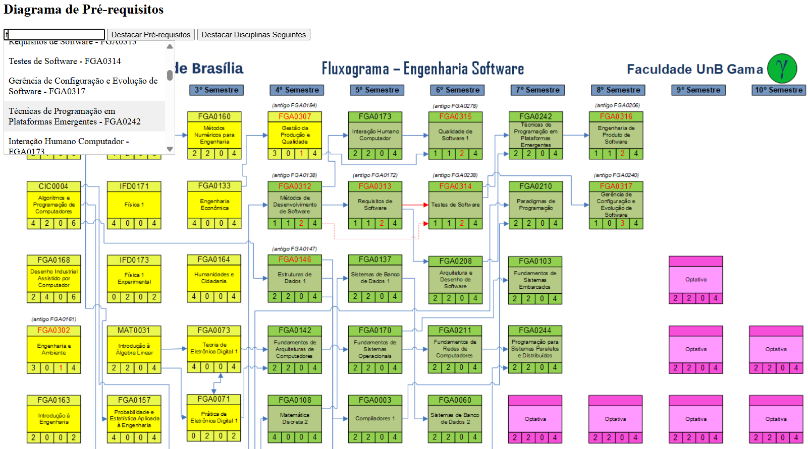
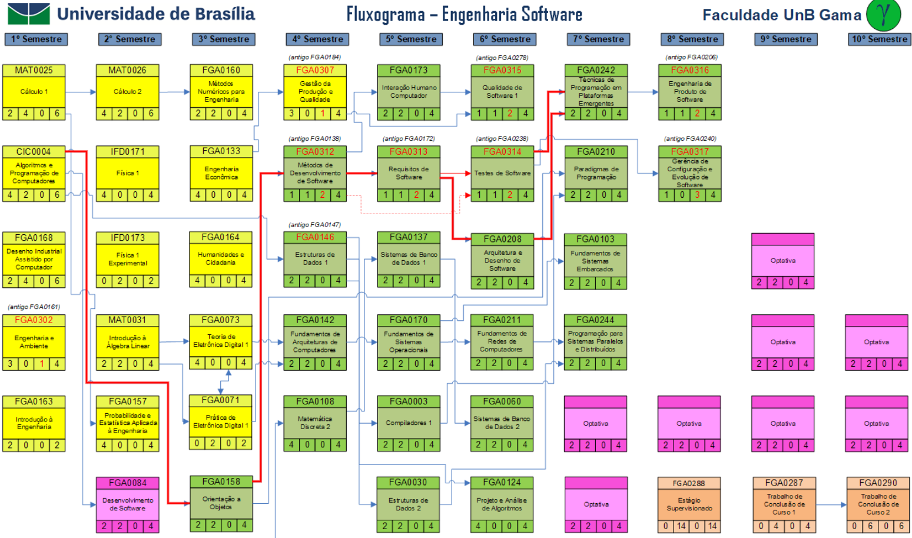
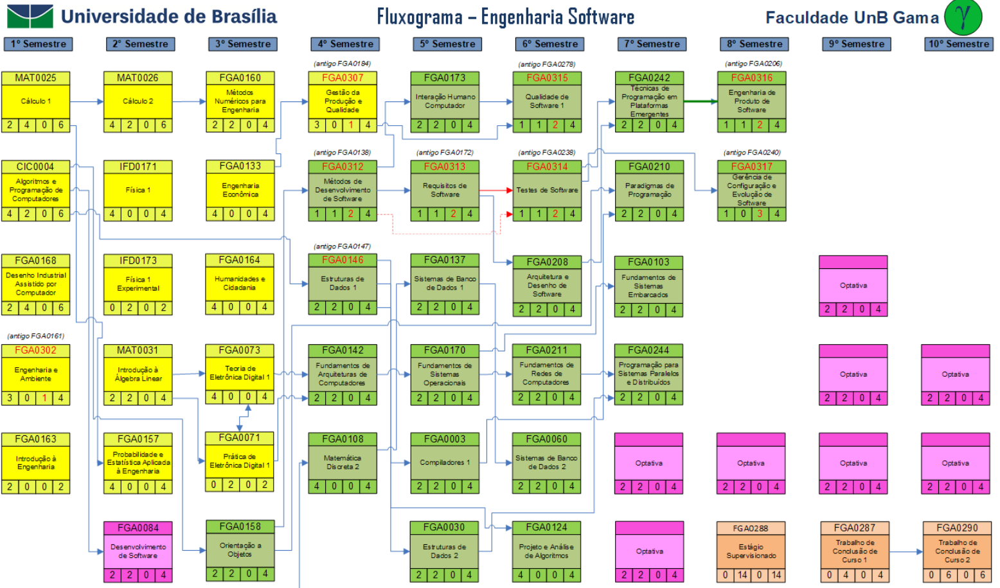

# Fluxograma ESW

**Número da Lista**: 23<br>
**Conteúdo da Disciplina**: Grafos 1<br>

## Alunos
|Matrícula | Aluno |
| -- | -- |
| 211030943  |  Artur Jackson Leal Fontinele |
| 211030774  |  Gustavo França Boa Sorte |

## Sobre 

Este projeto tem como objetivo criar uma interface visual para facilitar a compreensão dos pré-requisitos e disciplinas sequentes de uma disciplina específica relacionado ao curso Engenharia de Software - Universidade de Brasília (UnB) | Faculdade de Ciências e Tecnologias em Engenharia. A aplicação é especialmente útil para estudantes que desejam planejar sua trajetória acadêmica, permitindo que eles visualizem, de forma intuitiva e interativa, a relação entre as disciplinas e as dependências entre elas.

### Funcionamento

O projeto é desenvolvido com Flask, onde a aplicação web permite que o usuário selecione uma disciplina específica e visualize graficamente as conexões com outras disciplinas. A lógica central se baseia em dois algoritmos de grafos para determinar quais disciplinas são pré-requisitos e quais são sequentes de uma disciplina fornecida:

- Algoritmo de Pré-requisitos (DFS):

Este algoritmo utiliza uma Busca em Profundidade (DFS) para identificar todas as disciplinas que são pré-requisitos diretos e indiretos da disciplina escolhida.
A partir da disciplina selecionada, o algoritmo explora todos os pré-requisitos necessários, gerando uma lista que inclui as disciplinas que precisam ser cursadas antes dela.
As conexões entre as disciplinas identificadas como pré-requisitos são destacadas visualmente por setas que apontam para a disciplina selecionada, indicando a hierarquia de dependência.

- Algoritmo de Disciplinas Sequentes (BFS):

Usando uma Busca em Largura (BFS), este algoritmo encontra todas as disciplinas que têm a disciplina selecionada como pré-requisito direto.
As disciplinas sequentes são exibidas com setas saindo da disciplina fornecida e apontando para as disciplinas dependentes, mostrando quais matérias podem ser cursadas após a conclusão dela.

### Representação Visual

O diagrama de dependências carregado na interface, que pode ser econtrado [aqui](http://software.unb.br/ensino/estrutura-curricular) destaca as disciplinas e seus relacionamentos com cores e setas. As setas são desenhadas de acordo com as coordenadas obtidas a partir do arquivo ***coordenadas.json***, que define a posição e o layout gráfico dos elementos no diagrama. 

Quando o usuário entra na interface, aparecem duas opções caso ele tenha escolhido uma disciplina, facilitando a compreensão visual das cadeias de pré-requisitos e sequentes.

- Destacar Pré-requisitos

As setas são pintadas de **vermelho**, mostrando todas as diciplinas que fazem parte da lista de pré-requisitos 

- Destacar Disciplinas Sequentes

As setas são pintadas de **verde**, mostrando todas as disciplinas que serão liberadas 

### Benefícios

- Planejamento Acadêmico: A interface ajuda os alunos a visualizarem claramente as dependências entre disciplinas, o que pode auxiliá-los a planejar melhor a ordem em que cursam as matérias.

- Interface Intuitiva: A aplicação exibe informações complexas de maneira simples e visual, facilitando o entendimento das estruturas curriculares.

- Agilidade e Precisão: Ao utilizar os algoritmos de DFS e BFS, a aplicação consegue encontrar e destacar rapidamente as disciplinas relacionadas, proporcionando uma navegação ágil para o usuário.

Em resumo, este projeto combina algoritmos de grafos com uma interface intuitiva para apresentar de maneira eficaz as relações de pré-requisitos e sequências entre as disciplinas de um curso acadêmico, contribuindo para uma visão mais clara e planejada do percurso educacional dos estudantes.

## Screenshots

> Buscando a disciplina "Técnicas de Programação em Plataformas Emergentes - FGA0242"



________________________________________________________________________________

 >Percorrendo todos os pré-requisitos da disciplina escolhida"



Perceba que para "Técnicas de Programação em Plataformas Emergentes - FGA0242", foram encontrados os seguintes pré-requisitos diretos e indiretos:

- "Testes de Software - FGA0314"
- "Arquitetura e Desenho de Software - FGA0208"
- "Requisitos de Software - FGA0313"
- "Métodos de Desenvolvimento de Software - FGA0312"
- "Orientação a Objetos - FGA0154"
- "Algoritmo e Programação de Computadores - CIC0004"

________________________________________________________________________________


> Percorrendo todas as disciplinas seguintes



Perceba que para "Técnicas de Programação em Plataformas Emergentes - FGA0242", foram encontradas as disciplinas seguintes:

- "Engenharia de Produto de Software - FGA0316"

## Instalação 

**Linguagem**: Python<br>
**Framework**: Flask<br>

## Pré-requisitos

- **Python**: Certifique-se de que o Python (3.7 ou superior) está instalado no sistema.

### Instalação de Dependências

1. Clone o repositório:
   ```bash
   git clone git@github.com:projeto-de-algoritmos-2024/Grafos1_FluxogramaESW.git
   ```

2. Navegue até a pasta Grafos1_FluxogramaESW:
   ```bash
   cd Grafos1_FluxogramaESW.git
   ```

3. Execute o comando abaixo para iniciar a configuração do ambiente virtual:

    ```bash
    python3 -m venv venv
    ```

4. Ativando a Virtual Environment (venv) :

    ```bash
    # No Windows:

    venv\Scripts\activate

    # No Linux ou macOS:

    source venv/bin/activate
    ```

5. Instalando as dependências:

    ```bash
    pip install -r requirements.txt
    ```


4. Execute o seguinte comando de execução:
   ```bash
   python3 backend.py
   ```


## Uso 

Após utilizar o comando de execução, o usuário deve entrar no localhost apresentado no terminal: 

http://127.0.0.1:5000

Quando entrar na interface, pode começar o uso ao digitar uma disciplina específica :)

## Vídeo de Apresentação do Projeto

Contempla-se para o projeto, um vídeo que faz a apresentação do projeto FluxogramaESW explicando os algoritmos usados e a interface desenvolvida:

[Apresentação | FluxogramaESW](https://youtu.be/3QqrrJWemS8?si=e-ve4O05O1AjLpEE)


